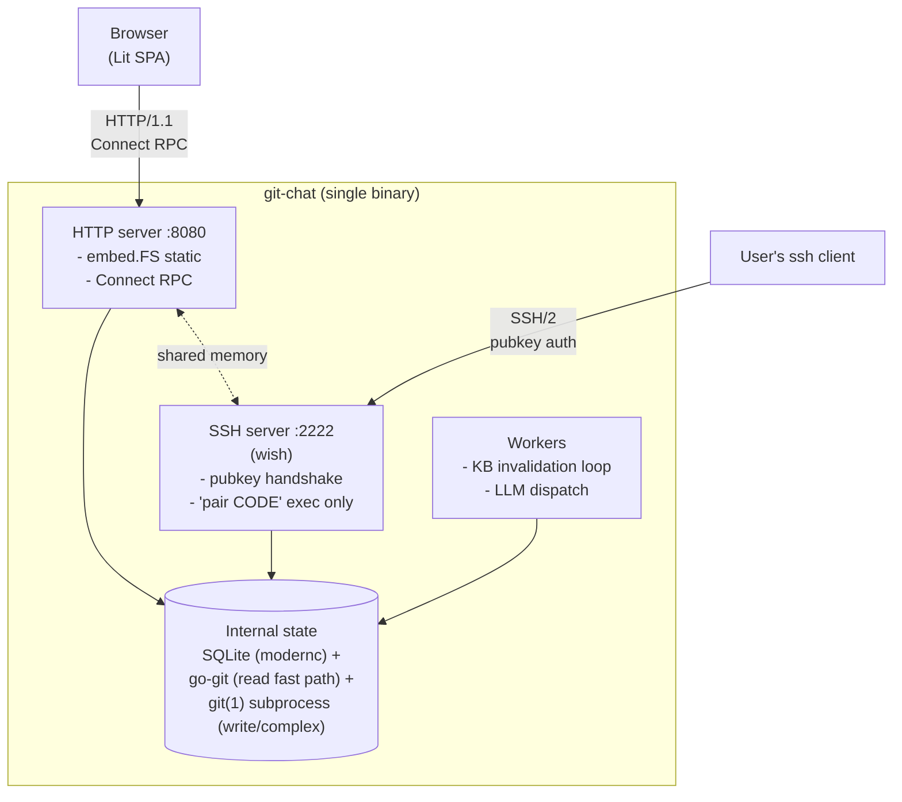
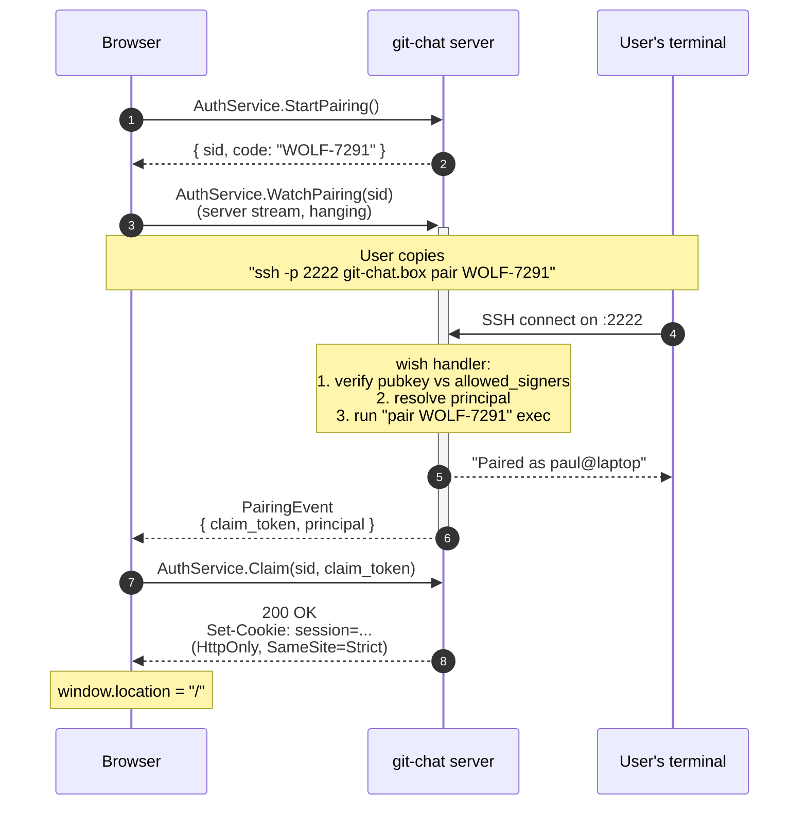
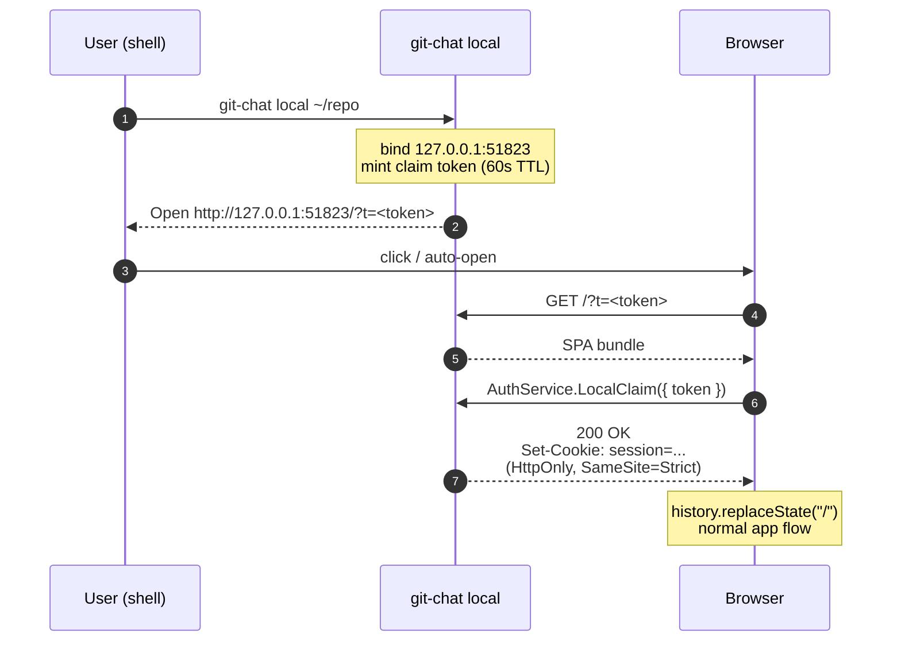

# git-chat — Architecture

> A self-hosted, persistent chat session bound to a git repository, with an
> automatically curated knowledge base of high-frequency queries that stays
> honest against the repo via git-aware invalidation.

Status: M0–M7 implemented + MCP server, global search, blame, branch
comparison RPCs, 23 e2e tests, CI pipeline. See HANDOFF.md for current
state, known issues, and next priorities. This document is the source
of truth for architectural decisions. When code and this document
disagree, update one of them — do not let drift accumulate.

---

## 1. Vision

git-chat is a single static binary you drop onto a machine that has a git
repository (or several). You connect to its web UI over an SSH-tunneled or
locally-bound HTTP port, authenticate by doing a short `ssh` pairing against
the server's embedded SSH interface, and then have a persistent,
repository-aware chat conversation with an LLM.

What makes it distinct from "RAG bot over a repo":

1. **Chats are persistent and navigable.** Every session is stored, searchable,
   and resumable. The chat history is a first-class view, not an afterthought.
2. **High-frequency queries are promoted to knowledge cards.** When the same
   question (or a semantically similar one) has been asked N times, its answer
   is frozen into a card.
3. **Knowledge cards are git-aware.** Each card records the file paths, line
   ranges, and blob SHAs it was derived from. When any of those blobs change,
   the card is automatically invalidated and re-verified. The knowledge base
   cannot drift from the repo because the repo invalidates it.
4. **Diffs and code are first-class chat primitives.** Code blocks render via
   Shiki; diffs render via `@pierre/diffs`. The chat stream carries typed
   `MessageChunk` variants for prose, diffs, and card hits — the UI does not
   parse markdown to find them.

---

## 2. Goals and non-goals

### Goals

- **Single binary, two deployment modes.** `go build` produces one static
  executable that serves both the self-hosted multi-user case and the
  solo-local case. No runtime dependencies except a `git` binary on `$PATH`.
- **Solo-local is first-class, not a degraded mode.** `git-chat local` is
  the zero-ceremony path for a developer who just wants to chat with their
  own repo on their own laptop. No SSH server, no key registration, no
  pairing codes — just a loopback-bound HTTP listener and a one-time claim
  URL printed to the terminal.
- **Self-hosted multi-user via SSH keys, no account management.** `git-chat
  serve` delegates authentication to public-key cryptography via an embedded
  wish-powered SSH server. No password table, no signup form, no "forgot
  password" flow.
- **Hacker-friendly DX.** Install is `go install` or a downloaded binary.
  Config is env vars + flags. No YAML soup.
- **Multi-repo.** One server instance manages multiple repositories.
- **Accurate, reduced UI.** Information density over decoration. Changes
  (diffs) and context (file/line provenance) are the primary visual elements.
- **LLM-agnostic.** Any OpenAI-compatible endpoint (LM Studio, Ollama,
  vLLM, OpenAI, Groq, DeepSeek, Together, etc.) via configurable base URL,
  plus an Anthropic-native adapter for production use. Primary dev target
  is local inference via LM Studio + Gemma — free to iterate against.

### Non-goals

- **Not a replacement for an IDE copilot.** No inline code completion, no
  editor integration. This is a chat tool.
- **Not a public multi-tenant SaaS.** The security model assumes the server
  is either loopback-bound or behind a trusted network / reverse proxy.
- **Not a git hosting platform.** git-chat reads from repositories; it does
  not receive pushes, serve clones, or host PRs. (Pair it with Soft Serve or
  Forgejo if you want that.)
- **Not a real-time collaboration tool.** Chat sessions are per-user. No
  shared cursors, no presence indicators.

---

## 3. High-level architecture



The binary runs two network listeners:

- **HTTP (default :8080)** — serves the embedded Lit SPA and the Connect RPC
  API. This is what the browser talks to.
- **SSH (default :2222)** — an embedded `charmbracelet/wish` server with
  exactly one command: `pair <CODE>`. This is not a shell. Its sole job is
  to complete the device pairing flow.

Both listeners share the same process memory — the pairing code lookup table
lives in RAM and is consumed by both.

---

## 4. Technology choices

### Backend: Go

**Chosen for:**
- Single static binary (with `CGO_ENABLED=0`) — core to the self-host story.
- `charmbracelet/wish` — battle-tested embedded SSH server; the reference
  implementation for this exact pattern (`soft-serve` uses it).
- Excellent stdlib `net/http`, `log/slog`, `embed`.
- In-process git via `go-git` for fast object access in the KB invalidation
  loop.

**Rejected: Bun + TypeScript.**
- `ssh2` under Bun is unvalidated for this workload.
- A long-running server process in Node/Bun has rougher operational edges
  (memory leaks in JIT, GC pauses under streaming load).
- Single-binary story requires `bun build --compile`, which ships the full
  Bun runtime and is harder to cross-compile.

**Rejected: Rust.**
- Build times and iteration velocity are a tax we do not need to pay for
  this workload. The bottleneck will be LLM latency, not CPU.

### Frontend: Lit + `@jpahd/lit-stack`

The user maintains `@jpahd/lit-stack`, a Lit framework extracted from production
apps. It provides `AbstractView` (paginated/searchable data views with URL
sync and `@lit/context`), `RequestHandler` (not used here — we use Connect
instead), `<stack-table>`, and `applyTheme()` for Shadow DOM theming.

git-chat consumes this framework. Specifically:

- The chat history list and knowledge base view use `AbstractView`.
- The live chat turn is a plain `LitElement` consuming a Connect server stream
  (same pattern as the lit-stack dashboard example's WebSocket activity feed,
  just with Connect instead of raw WS).
- Theming is injected via `applyTheme()` with CSS custom properties that
  `@pierre/diffs` also consumes (coordination via variables, not cascading).

### Type sharing: Connect-RPC + Buf

A single `.proto` file in `proto/gitchat/v1/` is the source of truth for all
client-server types. `buf generate` produces:

- Go server handlers (`gen/go/...`) — we implement the service interfaces.
- TypeScript clients (`gen/ts/...`) — the Lit frontend imports them.

**Why Connect over vanilla gRPC / gRPC-Web / REST:**
- Connect speaks HTTP/1.1 with JSON or binary bodies. Plain `fetch()` works.
  No `grpc-web` bridge, no Envoy, no reverse-proxy gymnastics.
- Server streaming is a native concept. The LLM token stream and the auth
  pairing notification both use `rpc Foo(Req) returns (stream Resp)` and
  consume as `for await (const x of client.foo(req))` on the TS side.
- `oneof` message variants give us exhaustively-typed discriminated unions
  in both Go (sealed interfaces) and TypeScript (`switch (chunk.kind.case)`).
  The chat stream's `MessageChunk` uses this to carry prose / diff / card
  hits without any runtime type guessing.

**Rejected: OpenAPI + codegen.**
- Streaming is awkward. SSE via OpenAPI codegen is not a solved problem.
- Discriminated unions require vendor extensions and tooling varies.

**Rejected: tygo (Go → TS struct codegen, REST).**
- Simpler but loses the server streaming codegen entirely. We would be
  hand-writing the streaming protocol, which is exactly what we want to avoid.

**Rejected: tRPC-like Go→TS bridges.**
- Nothing mature exists in this space for Go.

### Storage: SQLite via `modernc.org/sqlite`

Pure-Go driver, no CGO, meaning `CGO_ENABLED=0 go build` produces a fully
static binary that cross-compiles trivially.

**Perf cost:** ~2x slower than `mattn/go-sqlite3`. Irrelevant for our workload
(chat history writes + KB queries are low-volume).

**Consequence: no `sqlite-vec` in v1.** The vector-search SQLite extension
requires CGO loading. We use **FTS5** (built into every SQLite build) with
BM25 ranking for the "find similar questions" step of the KB promotion logic.
Embeddings-based similarity is a v2 consideration to be made only once real
query data proves FTS5 is insufficient.

### Git access: hybrid (`go-git` + shell-out)

- **`go-git/v5`** for hot-path reads: `ls-tree`, blob fetch, `log` walks,
  blob-SHA comparisons for KB invalidation. In-process, zero subprocess cost.
- **`git` subprocess** for anything `go-git` does not handle cleanly: complex
  merges, submodules, LFS, weird edge cases. Correctness > speed for these.

This hybrid is the standard pattern in the Go git tooling ecosystem.

### LLM adapters

- **OpenAI-compatible** via `sashabaranov/go-openai` — **primary adapter,
  shipped in M3**. Configurable `BaseURL` lets the same adapter speak to
  LM Studio, Ollama, vLLM, OpenAI, Groq, DeepSeek, Together, and anything
  else that implements `POST /v1/chat/completions` with `stream: true`.
  Default dev target is LM Studio on `http://localhost:1234/v1` with a
  locally-running Gemma model.
- **Anthropic** via `anthropics/anthropic-sdk-go` — **secondary adapter,
  shipped in M6**. Ships later because validating the interface against a
  non-native transport first is a stronger architectural test.

Both adapters implement a single internal `LLM` interface:

```go
type LLM interface {
    Stream(ctx context.Context, req CompletionRequest) (<-chan Chunk, error)
}
```

The Connect streaming handler pipes `Chunk`s into the `MessageChunk` stream
sent to the browser.

### Syntax highlighting and diffs

- **Shiki** on the frontend for all code rendering. To keep bundle size
  reasonable, the server scans the repo's file extensions on startup and
  returns the required language grammar list via an RPC, so the client only
  loads the grammars this repo actually uses.
- **`@pierre/diffs`** for diff rendering. Shadow-DOM based, which composes
  cleanly with Lit's Shadow DOM without style bleed. CSS custom properties
  (`--color-*`) coordinate theming between `lit-stack`, chat components, and
  the diff viewer.

---

## 5. Authentication

git-chat has **two authentication modes** — one per deployment shape. Both
modes land on the same session cookie contract at the end, so the rest of
the application does not know or care how the session was established.

| Mode | Subcommand | Listener binding | Auth mechanism |
|------|------------|------------------|----------------|
| Solo-local | `git-chat local` | `127.0.0.1` HTTP only; no SSH server | One-time claim URL printed to terminal |
| Self-hosted | `git-chat serve` | HTTP + embedded SSH server on :2222 | SSH pairing device flow with `allowed_signers` |

### 5.1 Self-hosted mode — SSH pairing device flow

The self-hosted authentication model is:

> If you can complete an SSH handshake against our embedded SSH server using
> a key listed in `allowed_signers`, you are that key's principal. No
> passwords, no session tokens stored on disk, no account rows.

#### First-time key registration

Done on the server by the admin (who may be the sole user):

```
git-chat add-key paul@laptop < ~/.ssh/id_ed25519.pub
```

This appends a line to `~/.config/git-chat/allowed_signers` in the standard
OpenSSH `AllowedSigners(5)` format. The file is read at server startup and
on SIGHUP.

#### Login flow



#### Why a two-phase (stream event → Claim RPC) instead of setting the cookie directly on the watch response

SSE-style streaming responses cannot reliably set cookies across all browsers
and reverse proxies. The `claim_token` is a short-lived (30s) nonce returned
on the stream; the subsequent `Claim` RPC is a plain unary call where setting
an `HttpOnly` cookie is boringly reliable.

#### Pairing code format

Word + 4-digit number (e.g. `WOLF-7291`). ~40 bits of entropy, 60 second TTL,
single use, bound to one `sid`. The word prefix makes it readable aloud, which
matters when the user is switching between their browser and terminal.

#### Security properties

- **No passwords anywhere.** The server never sees, stores, or validates a
  password for any purpose.
- **Key compromise is the only failure mode.** If an attacker steals your SSH
  key, they have as much access as `ssh` itself would give them — which is
  the property `~/.ssh/` already has.
- **Session cookies are HttpOnly + SameSite=Strict.** Not accessible to JS,
  not sent on cross-origin requests. 7-day TTL, rotated on each login.
- **The SSH server is not a shell.** Only the `pair <CODE>` command is
  accepted; all other exec requests are rejected. There is no PTY allocation,
  no shell spawn, no file system access.

#### Rejected alternative: `ssh-keygen -Y sign` paste flow

An earlier design had the browser show a challenge nonce, the user ran
`ssh-keygen -Y sign` locally, and pasted the armored signature into a text
box. Rejected because:

- Multi-line signature paste is high-friction.
- Hardware-backed FIDO2 SSH keys (`sk-ed25519`) are harder to sign with
  non-interactively than to use via a live SSH handshake.
- The pairing flow feels like `gh auth login` (familiar), while the paste
  flow feels like a science project.

### 5.2 Solo-local mode — one-time claim URL

The local-mode authentication model is:

> If you can read the terminal output of the process you just started, you
> are authenticated. The server binds only to `127.0.0.1`, so "read the
> terminal" implies "are running as the same user on the same machine" —
> which is a threat model the OS already enforces.

#### Usage

```
git-chat local                   # chat against CWD (must be a git repo)
git-chat local ~/code/my-repo    # chat against an explicit path
```

On startup, the server:

1. Binds HTTP to `127.0.0.1:0` (random free port) or a user-supplied port.
2. **Skips the SSH server entirely.** `allowed_signers` is not read; no host
   key is generated; port 2222 is not touched.
3. Generates a 32-byte random claim token, held in RAM with a 60-second TTL.
4. Prints a URL of the form `http://127.0.0.1:<port>/?t=<token>` to stderr
   and, if `$DISPLAY`/`$WAYLAND_DISPLAY`/macOS is detected, invokes
   `open` / `xdg-open` to launch the browser.

#### Claim flow



`LocalClaim` is a unary RPC on `AuthService`, parallel to `Claim` from the
pairing flow. It validates the token, consumes it (single-use), and issues
a session cookie for a synthetic `local` principal.

#### Security properties

- **Loopback-only binding.** In local mode the HTTP listener refuses any
  address other than `127.0.0.1` / `::1`. Binding to `0.0.0.0` is a hard
  error; the user must re-run with `git-chat serve` if they want network
  exposure.
- **Token is single-use, in-memory, 60-second TTL.** After the browser
  claims it, it is deleted. A second request with the same token is
  rejected.
- **No persistent principals.** The `local` principal exists for the
  session lifetime only; nothing is written to disk. Restarting the binary
  requires a fresh claim URL.
- **No SSH attack surface.** Port 2222 is never opened in local mode.

#### Why a URL-embedded token instead of a cookie directly

The server cannot set a cookie on a request it has not yet received, and
the first request from the browser is the SPA fetch. Embedding the token in
the initial URL lets the SPA claim it via a subsequent RPC that sets the
cookie on its response. The URL is then stripped via `history.replaceState`
so the token never persists in browser history.

**Rejected alternative:** writing a session cookie file to disk and having
the server instruct the browser to fetch it via a special endpoint. Rejected
because it touches the filesystem, leaves cleanup obligations, and has no
ergonomic advantage over a URL parameter.

---

## 6. Data model

All persistent state lives in a single SQLite database at
`~/.local/state/git-chat/state.db`.

```sql
-- Repositories this server manages.
CREATE TABLE repo (
  id         TEXT PRIMARY KEY,      -- stable slug, e.g. "git-chat"
  path       TEXT NOT NULL UNIQUE,  -- absolute filesystem path
  label      TEXT NOT NULL,         -- display name
  created_at INTEGER NOT NULL
);

-- Registered SSH public keys. Mirrors allowed_signers file; file wins on conflict.
CREATE TABLE principal (
  id         TEXT PRIMARY KEY,      -- e.g. "paul@laptop"
  pubkey     TEXT NOT NULL,         -- openssh format
  added_at   INTEGER NOT NULL
);

-- Browser session cookies.
CREATE TABLE session (
  token_hash TEXT PRIMARY KEY,      -- sha256 of cookie value; cookie itself never stored
  principal  TEXT NOT NULL REFERENCES principal(id),
  created_at INTEGER NOT NULL,
  expires_at INTEGER NOT NULL
);

-- Chat sessions (conversation threads).
CREATE TABLE chat_session (
  id         TEXT PRIMARY KEY,
  repo_id    TEXT NOT NULL REFERENCES repo(id),
  principal  TEXT NOT NULL REFERENCES principal(id),
  title      TEXT NOT NULL,         -- auto-generated from first message
  created_at INTEGER NOT NULL,
  updated_at INTEGER NOT NULL
);

-- Individual messages in a chat session.
CREATE TABLE chat_message (
  id              TEXT PRIMARY KEY,
  session_id      TEXT NOT NULL REFERENCES chat_session(id) ON DELETE CASCADE,
  role            TEXT NOT NULL,         -- 'user' | 'assistant' | 'system'
  content         TEXT NOT NULL,         -- markdown; diff refs embedded as fenced blocks
  model           TEXT,                  -- e.g. "claude-opus-4-6"
  token_count_in  INTEGER,
  token_count_out INTEGER,
  card_hit_id     TEXT REFERENCES kb_card(id),  -- non-null if answer came from KB
  created_at      INTEGER NOT NULL
);

-- FTS5 index over user messages for similarity matching.
CREATE VIRTUAL TABLE chat_message_fts USING fts5(
  content,
  content='chat_message',
  content_rowid='rowid',
  tokenize='porter unicode61'
);

-- Knowledge cards: promoted answers to high-frequency queries.
CREATE TABLE kb_card (
  id                  TEXT PRIMARY KEY,
  repo_id             TEXT NOT NULL REFERENCES repo(id),
  question_canonical  TEXT NOT NULL,    -- cluster label, human-readable
  answer_md           TEXT NOT NULL,    -- frozen answer
  hit_count           INTEGER NOT NULL DEFAULT 1,
  created_commit      TEXT NOT NULL,    -- git SHA when card was derived
  last_verified_commit TEXT NOT NULL,   -- SHA at most recent validation pass
  invalidated_at      INTEGER,          -- NULL = currently valid
  created_at          INTEGER NOT NULL,
  updated_at          INTEGER NOT NULL
);

-- FTS5 index over cards for fast "do we already have an answer for this?" lookup.
CREATE VIRTUAL TABLE kb_card_fts USING fts5(
  question_canonical,
  content='kb_card',
  content_rowid='rowid'
);

-- Provenance: which files and line ranges a card depends on.
CREATE TABLE kb_card_provenance (
  card_id     TEXT NOT NULL REFERENCES kb_card(id) ON DELETE CASCADE,
  path        TEXT NOT NULL,
  line_start  INTEGER,               -- NULL = whole file
  line_end    INTEGER,
  blob_sha    TEXT NOT NULL,         -- git blob SHA at time of card derivation
  PRIMARY KEY (card_id, path, line_start, line_end)
);

CREATE INDEX kb_provenance_path ON kb_card_provenance(path);
```

---

## 7. Knowledge base lifecycle

### Promotion (query → card)

1. User asks a question in a chat session.
2. Server tokenizes the question and runs an FTS5 `MATCH` against
   `kb_card_fts` to find an existing valid card. If one matches with BM25
   score above threshold, return the card's `answer_md` directly and
   increment `hit_count`. **This is the fast path — no LLM call.**
3. If no card matches, run FTS5 against `chat_message_fts` (user-role only)
   to find similar historical questions across all sessions.
4. If ≥ `N` (default 3) similar prior questions exist and the answers the LLM
   produced for them are consistent, promote this query+answer to a new card.
   The promotion step extracts provenance by asking the LLM to list the file
   paths and line ranges it relied on (structured output).
5. Store the card with `created_commit = HEAD`, populate `kb_card_provenance`
   with current blob SHAs from `go-git`.

### Invalidation (repo change → card staleness)

Runs on two triggers:

1. **On every query** — cheap prefilter. Before serving a card from cache,
   verify its `last_verified_commit` matches `HEAD`. If not, run the full
   check below.
2. **On a `git` change watcher** — filesystem watch on `.git/HEAD` and
   `.git/refs/`. When HEAD moves, enqueue a full validation pass.

**Full validation pass for a card:**

```
for each provenance row (path, line_start, line_end, recorded_blob_sha):
    current_blob_sha = git_ls_tree(HEAD, path)
    if current_blob_sha == recorded_blob_sha:
        continue  # file unchanged
    if line_start is NULL:
        invalidate(card); break  # whole-file dependency, any change = stale
    # Compare the specific line range in old vs new blob.
    diff = blob_diff(recorded_blob_sha, current_blob_sha)
    if diff touches [line_start, line_end]:
        invalidate(card); break
    # Changes are outside the dependency range; auto-refresh provenance.
    update provenance set blob_sha = current_blob_sha
update card.last_verified_commit = HEAD
```

Invalidated cards remain in the table but are excluded from the fast-path
lookup. The user sees "this answer may be stale — re-deriving" in the chat
UI and the LLM is invoked to produce a fresh answer, which updates the card
in place with a new `created_commit`.

**Why this is the whole point:** the knowledge base cannot lie. Every cached
answer has verifiable provenance, and the moment that provenance ceases to
describe the repo, the answer is marked untrusted. Contrast with a naive
embedding-based RAG cache, which happily returns stale answers until a human
notices.

### Multi-user sharing and attribution

Knowledge cards are shared across all principals at the repository level.
Cards are promoted when multiple users ask similar questions (configurable
threshold via `GITCHAT_KB_PROMOTION_THRESHOLD`). The `created_by` field
tracks which principal's question triggered promotion. Cards can be viewed
and deleted via the `ListCards`/`DeleteCard` RPCs exposed on `ChatService`,
surfaced in the settings modal under "Knowledge Base".

---

## 8. Connect service surface

Three services, all defined in `proto/gitchat/v1/`.

```proto
service AuthService {
  rpc StartPairing(StartPairingRequest) returns (StartPairingResponse);
  rpc WatchPairing(WatchPairingRequest) returns (stream PairingEvent);
  rpc Claim(ClaimRequest) returns (ClaimResponse);
  rpc Whoami(WhoamiRequest) returns (WhoamiResponse);
  rpc Logout(LogoutRequest) returns (LogoutResponse);
}

service RepoService {
  rpc ListRepos(ListReposRequest) returns (ListReposResponse);
  rpc ListBranches(ListBranchesRequest) returns (ListBranchesResponse);
  rpc GetFile(GetFileRequest) returns (GetFileResponse);
  rpc GetDiff(GetDiffRequest) returns (GetDiffResponse);
  rpc RequiredGrammars(RequiredGrammarsRequest) returns (RequiredGrammarsResponse);
}

service ChatService {
  rpc ListSessions(ListSessionsRequest) returns (ListSessionsResponse);
  rpc GetSession(GetSessionRequest) returns (GetSessionResponse);
  rpc SendMessage(SendMessageRequest) returns (stream MessageChunk);
  rpc DeleteSession(DeleteSessionRequest) returns (DeleteSessionResponse);
}

service KBService {
  rpc ListCards(ListCardsRequest) returns (ListCardsResponse);
  rpc GetCard(GetCardRequest) returns (GetCardResponse);
  rpc SearchCards(SearchCardsRequest) returns (SearchCardsResponse);
  rpc RevalidateCard(RevalidateCardRequest) returns (RevalidateCardResponse);
}

message MessageChunk {
  oneof kind {
    string         token    = 1;  // LLM text token
    KnowledgeCard  card_hit = 2;  // fast-path: answer came from KB
    DiffRef        diff     = 3;  // structured diff reference
    FileRef        file     = 4;  // structured file reference (provenance)
    Done           done     = 5;  // terminal chunk with usage stats
  }
}
```

The `oneof` on `MessageChunk` is what makes the chat stream type-safe
end-to-end: the browser `switch (chunk.kind.case)` exhausts all variants at
compile time.

---

## 9. Repository layout

```
git-chat/
├── cmd/
│   └── git-chat/
│       ├── main.go              # binary entrypoint, flag parsing
│       └── subcommands.go       # add-key, serve, migrate, etc.
├── internal/
│   ├── auth/                    # wish SSH server, pairing state, sessions
│   │   ├── ssh.go
│   │   ├── pairing.go
│   │   └── cookies.go
│   ├── chat/                    # chat session logic, LLM dispatch
│   │   ├── service.go           # Connect handler impls
│   │   ├── stream.go            # token stream fan-out
│   │   └── llm/
│   │       ├── anthropic.go
│   │       └── openai.go        # openai-compatible adapter
│   ├── kb/                      # knowledge cards
│   │   ├── promote.go           # query → card promotion
│   │   ├── invalidate.go        # git-aware invalidation loop
│   │   └── service.go
│   ├── repo/                    # git operations
│   │   ├── gogit.go             # go-git read fast path
│   │   ├── shell.go             # git(1) subprocess fallbacks
│   │   └── service.go
│   ├── rpc/                     # cross-service Connect wiring
│   │   ├── server.go
│   │   └── interceptors.go      # auth, logging, panic recovery
│   └── storage/                 # sqlite
│       ├── db.go
│       ├── migrations/
│       └── queries.sql
├── proto/
│   └── gitchat/
│       └── v1/
│           ├── auth.proto
│           ├── chat.proto
│           ├── repo.proto
│           └── kb.proto
├── gen/                         # generated code (committed; diff-suppressed via .gitattributes)
│   ├── go/
│   └── ts/
├── web/                         # Lit SPA (consumed by embed.FS at build time)
│   ├── src/
│   │   ├── app.ts               # root element
│   │   ├── views/
│   │   │   ├── chat-view.ts
│   │   │   ├── repo-view.ts
│   │   │   └── kb-view.ts       # AbstractView
│   │   ├── components/
│   │   │   ├── message-turn.ts
│   │   │   ├── diff-panel.ts    # wraps @pierre/diffs
│   │   │   ├── card-chip.ts
│   │   │   └── auth-pairing.ts
│   │   ├── lib/
│   │   │   ├── transport.ts     # Connect transport setup
│   │   │   └── theme.ts         # applyTheme() with CSS custom props
│   │   └── main.ts              # entry
│   ├── index.html
│   ├── package.json
│   ├── vite.config.ts
│   └── tsconfig.json
├── docs/
│   └── ARCHITECTURE.md          # this file
├── buf.yaml
├── buf.gen.yaml
├── Makefile
├── go.mod
└── README.md
```

The built Vite bundle is copied into a location readable by `//go:embed` at
build time, so the final binary is fully self-contained.

---

## 10. Build and deploy

### Generated code is committed but diff-suppressed

`gen/` lives in git so fresh clones build without `buf` installed, but a
top-level `.gitattributes` hides it from normal git diff output and collapses
it in GitHub PR views:

```gitattributes
gen/** linguist-generated=true
gen/** -diff
gen/** -merge
```

- `linguist-generated=true` — GitHub collapses these files in PR diffs and
  excludes them from language statistics.
- `-diff` — `git diff`, `git log -p`, `git show` all report "Binary files
  differ" for generated files. Run `git diff -- gen/` explicitly if you
  ever want to see the actual diff (rare).
- `-merge` — generated files never merge; conflicts here always mean "re-run
  `buf generate`," so we skip the merge driver entirely.

The `.proto` files remain fully visible and reviewed normally. Reviewers see
the schema change in `proto/` and trust that `gen/` follows deterministically.
CI enforces this with a `make proto && git diff --exit-code gen/` check so
stale `gen/` can never be merged.

### Developer workflow

```
make proto      # buf generate → gen/go/, gen/ts/
make web        # cd web && bun install && bun run build
make build      # go build -tags netgo -ldflags "-s -w" ./cmd/git-chat
make dev        # runs buf generate + go run + vite dev in parallel
```

### Cross-compilation

```
CGO_ENABLED=0 GOOS=linux   GOARCH=amd64 go build -o dist/git-chat-linux-amd64   ./cmd/git-chat
CGO_ENABLED=0 GOOS=darwin  GOARCH=arm64 go build -o dist/git-chat-darwin-arm64  ./cmd/git-chat
```

Because `modernc.org/sqlite` is pure Go and we `//go:embed` all assets, this
Just Works. No libc, no cross-compiler dance.

### Deploy — self-hosted

```
scp dist/git-chat-linux-amd64 box:/usr/local/bin/git-chat
ssh box 'git-chat add-key paul@laptop < ~/.ssh/id_ed25519.pub'
ssh box 'systemctl --user start git-chat'
# then, from the laptop:
ssh -L 8080:localhost:8080 box   # or expose behind a reverse proxy
```

### Run — solo-local

```
go install github.com/pders01/git-chat/cmd/git-chat@latest
cd ~/code/my-repo
git-chat local
# → Open http://127.0.0.1:51823/?t=<token>
```

That is the entire install story.

---

## 11. Build sequence

Milestones are ordered by risk reduction, not by user-visible value. Each
milestone is a mergeable PR that leaves `main` in a runnable state.

**M0 — Scaffold.** Go module, `buf` config, empty Lit app, Makefile, embed.FS
wiring. `git-chat serve` binds HTTP on :8080 and Wish SSH on :2222. Serves
"hello" from both. Single binary builds cleanly. Zero features.

**M1 — Auth (both modes).** Pairing flow end-to-end plus solo-local mode.
`proto/gitchat/v1/auth.proto`, full `AuthService` implementation
(StartPairing/WatchPairing/Claim/LocalClaim/Whoami/Logout), `allowed_signers`
file parser, session cookie middleware, wish SSH middleware rewrite (pubkey
auth + `pair CODE` exec handler), CLI subcommand dispatch (`serve`, `local`,
`add-key`), Lit pairing view + local-claim handler. Ends with: `git-chat
local` auto-opens a browser into an authenticated session, and `git-chat
serve` + `ssh pair CODE` logs the same browser in via the pairing flow.

**M2 — Repo browsing.** Add repo, list branches, fetch file content, client
renders with Shiki. `RepoService` with `go-git` backend. No chat, no LLM.

**M3 — Chat, minimal (OpenAI-compatible primary).** `ChatService.SendMessage`
streams tokens from an OpenAI-compatible endpoint (LM Studio / Ollama /
vLLM / any endpoint that implements `POST /v1/chat/completions` with
`stream: true`). This is intentionally the *first* LLM backend we ship —
dog-fooding with a local Gemma model is free, validates the LLM interface
under a non-canonical transport (SSE framing), and keeps iteration fast
during the rest of the build sequence. SQLite arrives in this milestone
for chat persistence. Retrieval is deliberately minimal: explicit `@file`
mentions in the user message inject the referenced file's content into the
system prompt. Smarter retrieval lands with M5's knowledge cards. The Lit
`message-turn` component renders streaming tokens.

**M4 — Diffs as chat primitives.** Add `RepoService.GetDiff` (unified
patch for a single file between two refs, using a hand-rolled LCS in
`internal/repo/reader.go`). Teach the system prompt to emit
`[[diff from=X to=Y path=Z]]` markers on their own line instead of
fenced diff code blocks. The frontend's markdown pipeline
(`web/src/lib/markdown.ts:expandDiffMarkers`) detects these markers
before marked parses the text, resolves them in parallel via a
caller-supplied `DiffResolver` closure (bound to `repoId` in the chat
view), and replaces them with fenced ```` ```diff ```` blocks. Shiki's
existing `diff` grammar highlights them via the same walkTokens pass
that handles every other code block.

The `MessageChunk` proto extension originally planned for M4 (`DiffRef`
oneof variant) was deliberately deferred. Client-side marker detection
after the stream completes is simpler and matches the architecture's
principle of "the chat stream carries typed variants" — here the type
is determined by the markdown pipeline rather than the proto oneof,
but the server-side contract (`GetDiff` RPC) is typed end-to-end.
Proto extension can land when we need streaming-diff UX, which
requires pausing token forwarding while waiting for `GetDiff` — a
meaningful complexity bump we don't yet need.

The `@pierre/diffs` integration is also deferred to M4.1: the first
iteration uses Shiki's built-in `diff` grammar (already in the bundle)
for highlighting, which is a strictly smaller dependency surface and
renders correctly for our needs.

**M5 — Knowledge cards.** FTS5 schemas, promotion logic, provenance table,
invalidation loop. Fast-path lookup in `ChatService.SendMessage`. `KBService`
for listing and inspecting cards.

**M6 — Anthropic adapter.** Second LLM backend via the official
`anthropics/anthropic-sdk-go`. Config-selectable via `--llm-backend=anthropic`.
Moved from its original slot (M3) because validating the LLM interface
against a non-native transport first is a stronger architectural test — if
M3 works against LM Studio's SSE framing, the interface has proven it is
not accidentally Anthropic-shaped.

**M7 — Multi-repo UX.** Repo switcher in the header, per-repo KB isolation,
URL scheme `/r/:repo/chat/:session`.

**M0 + M1 together de-risk the entire architecture.** Wish, Connect
streaming, and Lit all meet for the first time in M1. If that works, the
rest is execution.

---

## 12. Open questions

These are not blockers for M0 but must be answered before their respective
milestones.

1. **Embedding-based similarity for KB matching.** v1 uses FTS5 / BM25.
   When (if) we add embeddings, do we accept CGO for `sqlite-vec`, or run a
   separate pure-Go vector store like `chromem-go`? **Decision deferred to
   post-M5 based on real query data.**

2. **Filesystem watch library.** `fsnotify` is the standard answer. Edge
   cases on macOS with large repos may push us toward `go-git`'s own
   polling-based approach. **Decision during M5.**

3. **LLM provenance extraction.** How do we reliably get the LLM to tell us
   which files and line ranges its answer depended on? Structured outputs
   via Anthropic's tool use is the leading candidate. **Decision during M5.**

4. **KB promotion threshold.** Default `N=3` similar queries before
   promotion. Should this be user-configurable per-repo? **Decision during
   M5 based on feel.**

---

## 13. Non-obvious design choices worth remembering

- **The SSH server is not sshd, it is Wish.** We intentionally do not touch
  the system `sshd`. This is both for simplicity (no config file edits, no
  root) and security (the embedded server refuses all commands except
  `pair`, there is no attack surface to shell out).
- **SQLite is the only database.** No Redis for pairing codes, no separate
  vector store in v1. A single file is the entire persistent state. Backup
  is `cp`.
- **Embeddings are a v2 feature, not a v1 feature.** BM25 on short queries
  is surprisingly good for this use case. Resist the urge to add vectors
  before we have data proving we need them.
- **`go-git` is a read optimization, not a requirement.** Every operation
  that uses `go-git` must have a shell-out fallback in `internal/repo/shell.go`
  for correctness. `go-git` is the fast path; `git(1)` is the correct path.
- **Connect streaming replaces both SSE and WebSockets.** The pairing flow,
  the LLM token stream, and any future live-update needs all go through the
  same mechanism: server-streaming Connect RPCs consumed as async iterators.
  There is exactly one way to push data from server to browser.
- **The knowledge base earns its keep via invalidation, not retrieval.**
  Retrieval is easy. What makes this project unique is that the cache
  invalidates itself when the repo changes. If you ever find yourself
  de-prioritizing the invalidation loop, you are building a different
  product.
- **Git SHAs: full in proto, short in UI, prefix-match on cross-component
  navigation.** Proto messages (GetBlame, ListCommits) always carry full
  40-char SHAs. Components display shortened 7-char versions. When one
  component navigates to another by SHA (e.g. blame tooltip → commit log),
  the receiver must resolve short SHAs via `startsWith` against its loaded
  data. Never assume a SHA passed between components is full-length.
- **Theme: data-attribute, not class swap.** Dark tokens live in `:root`,
  light overrides in `[data-theme="light"]`. The `settings.ts` theme module
  sets the attribute on `<html>` and listens to `prefers-color-scheme` for
  "system" mode. Every component inherits the theme through CSS custom
  properties — zero per-component theme logic.
