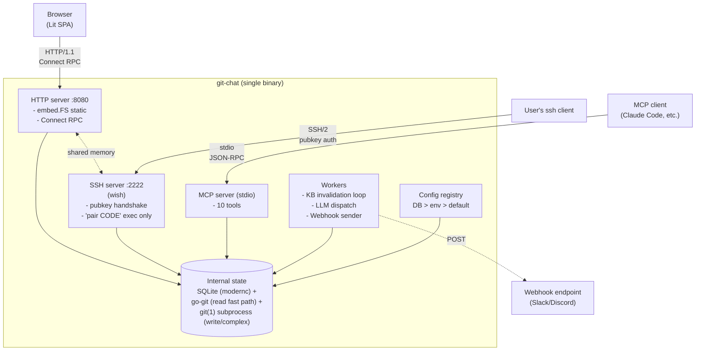
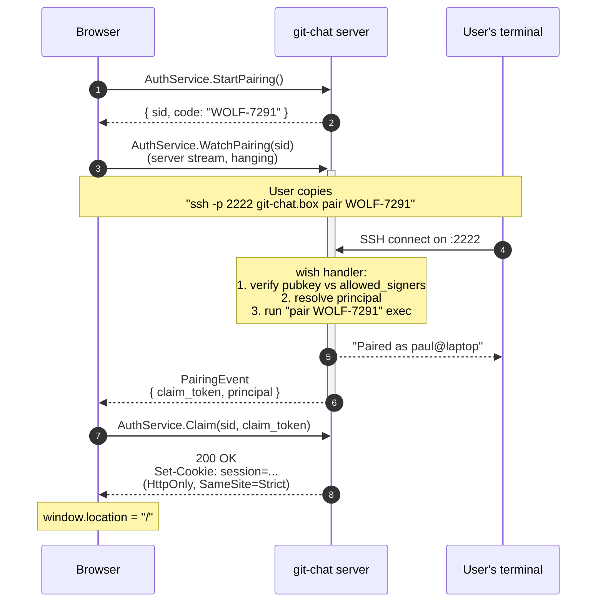

# git-chat -- Architecture

> A self-hosted, persistent chat session bound to a git repository, with an
> automatically curated knowledge base of high-frequency queries that stays
> honest against the repo via git-aware invalidation.

This document is the source of truth for architectural decisions. When code
and this document disagree, update one of them -- do not let drift accumulate.

---

## 1. Vision

git-chat is a single static binary you drop onto a machine that has a git
repository (or several). You connect to its web UI over an SSH-tunneled or
locally-bound HTTP port, authenticate by doing a short `ssh` pairing against
the server's embedded SSH interface, and then have a persistent,
repository-aware chat conversation with an LLM.

What makes it distinct from "RAG bot over a repo":

1. **Chats are persistent and navigable.** Every session is stored, searchable,
   and resumable. The chat history is a first-class view, not an afterthought.
2. **High-frequency queries are promoted to knowledge cards.** When the same
   question (or a semantically similar one) has been asked N times, its answer
   is frozen into a card.
3. **Knowledge cards are git-aware.** Each card records the file paths, line
   ranges, and blob SHAs it was derived from. When any of those blobs change,
   the card is automatically invalidated and re-verified. The knowledge base
   cannot drift from the repo because the repo invalidates it.
4. **Diffs and code are first-class chat primitives.** Code blocks render via
   Shiki; diffs render via Shiki diff grammar. The chat stream carries typed
   `MessageChunk` variants for prose, diffs, and card hits -- the UI does not
   parse markdown to find them.

---

## 2. Goals and non-goals

### Goals

- **Single binary, three modes.** `go build` produces one static executable:
  `git chat` (local, auto-detect repo, multi-repo workspace support),
  `git chat serve` (multi-user), `git chat mcp` (MCP server on stdio). No
  runtime dependencies except `git` on `$PATH`.
- **Solo-local is first-class, not a degraded mode.** `git chat` is the
  zero-ceremony path for a developer. No SSH server, no key registration, no
  pairing codes -- just a loopback-bound HTTP listener and a one-time claim
  URL printed to the terminal.
- **Self-hosted multi-user via SSH keys, no account management.** `git chat
  serve` delegates authentication to public-key cryptography via an embedded
  wish-powered SSH server.
- **Hacker-friendly DX.** Install is `go install` or a downloaded binary.
  Config is env vars + flags. No YAML soup.
- **Multi-repo.** One server instance manages multiple repositories.
- **Accurate, reduced UI.** Information density over decoration. Changes
  (diffs) and context (file/line provenance) are the primary visual elements.
- **LLM-agnostic.** Any OpenAI-compatible endpoint (LM Studio, Ollama,
  vLLM, OpenAI, Groq, DeepSeek, Together, etc.) via configurable base URL,
  plus an Anthropic-native adapter for production use.

### Non-goals

- **Not a replacement for an IDE copilot.** No inline code completion, no
  editor integration. This is a chat tool.
- **Not a public multi-tenant SaaS.** The security model assumes the server
  is either loopback-bound or behind a trusted network / reverse proxy.
- **Not a git hosting platform.** git-chat reads from repositories; it does
  not receive pushes, serve clones, or host PRs.
- **Not a real-time collaboration tool.** Chat sessions are per-user. No
  shared cursors, no presence indicators.

---

## 3. High-level architecture



The binary runs two network listeners plus an optional stdio server:

- **HTTP (default :8080)** -- serves the embedded Lit SPA and the Connect RPC
  API. This is what the browser talks to.
- **SSH (default :2222)** -- an embedded `charmbracelet/wish` server with
  exactly one command: `pair <CODE>`. Not a shell. Its sole job is to
  complete the device pairing flow.
- **MCP (stdio)** -- `git chat mcp` runs a JSON-RPC MCP server on stdin/stdout,
  exposing 10 tools: `search_knowledge`, `get_file`, `get_diff`, `list_commits`,
  `search_files`, `search_code` (ripgrep), `outline` (ctags), `list_tree`,
  `list_branches`, `get_blame`. Used by Claude Code and other MCP-compatible agents.

HTTP and SSH listeners share the same process memory -- the pairing code
lookup table lives in RAM and is consumed by both.

---

## 4. Technology choices

### Backend: Go

**Chosen for:**
- Single static binary (with `CGO_ENABLED=0`) -- core to the self-host story.
- `charmbracelet/wish` -- battle-tested embedded SSH server.
- Excellent stdlib `net/http`, `log/slog`, `embed`.
- In-process git via `go-git` for fast object access in the KB invalidation loop.

### Frontend: Lit + `@jpahd/lit-stack`

The user maintains `@jpahd/lit-stack`, a Lit framework extracted from production
apps. It provides `AbstractView` (paginated/searchable data views with URL
sync and `@lit/context`), `<stack-table>`, and `applyTheme()` for Shadow DOM
theming.

git-chat consumes this framework:
- Chat history list and knowledge base view use `AbstractView`.
- Live chat turn is a plain `LitElement` consuming a Connect server stream.
- Theming via `applyTheme()` with CSS custom properties.

### Type sharing: Connect-RPC + Buf

A single `.proto` file in `proto/gitchat/v1/` is the source of truth for all
client-server types. `buf generate` produces:

- Go server handlers (`gen/go/`) -- we implement the service interfaces.
- TypeScript clients (`web/src/gen/`) -- the Lit frontend imports them.

**Why Connect over vanilla gRPC / REST:**
- Connect speaks HTTP/1.1 with JSON or binary bodies. Plain `fetch()` works.
  No `grpc-web` bridge, no Envoy.
- Server streaming is a native concept. The LLM token stream and the auth
  pairing notification both use `rpc Foo(Req) returns (stream Resp)`.
- `oneof` message variants give exhaustively-typed discriminated unions in
  both Go and TypeScript.

### Storage: SQLite via `modernc.org/sqlite`

Pure-Go driver, no CGO, meaning `CGO_ENABLED=0 go build` produces a fully
static binary that cross-compiles trivially.

**No `sqlite-vec` in v1.** We use **FTS5** with BM25 ranking for KB similarity
matching. Embeddings-based similarity is a v2 consideration.

### Git access: hybrid (`go-git` + shell-out)

- **`go-git/v5`** for hot-path reads: `ls-tree`, blob fetch, `log` walks,
  blob-SHA comparisons for KB invalidation. In-process, zero subprocess cost.
- **`git` subprocess** for anything `go-git` does not handle cleanly: complex
  merges, submodules, LFS, weird edge cases. Correctness > speed for these.

### LLM adapters

Both adapters implement a single internal `LLM` interface:

```go
type LLM interface {
    Stream(ctx context.Context, req Request) (<-chan Chunk, error)
    Capabilities(ctx context.Context, model string) Capabilities
}
```

- **OpenAI-compatible** via `sashabaranov/go-openai` -- configurable `BaseURL`
  speaks to LM Studio, Ollama, vLLM, OpenAI, Groq, DeepSeek, Together, etc.
- **Anthropic** via `anthropics/anthropic-sdk-go` -- native adapter for
  production.

`Chunk` carries one of: text token, reasoning/thinking delta, tool_use
(fully-assembled args), or terminal done. `Request` carries messages,
a tool spec catalog, temperature, max tokens. `Message` supports
system/user/assistant/tool roles with optional attachments and
`ToolCalls` on assistant turns.

#### Capability probe

`Capabilities(ctx, model)` reports what an adapter/model combination
supports (today: image input). Results cached per-process per-model.

- **Anthropic**: name-table — every Claude 3, 3.5, 3.7, 4 family model
  ships with vision; retired Claude 2 / Instant do not.
- **OpenAI-compatible**: resolves in order — `GITCHAT_VISION_MODELS`
  env allowlist → Ollama `/api/show` (looks for CLIP / mllama families)
  → LM Studio `/api/v0/models` (`vision` boolean) → name heuristic
  (gpt-4o, llava, qwen-vl, gemma3, pixtral, …).

Service uses the capability answer to strip incompatible attachments
before they hit the model, emitting a warning on the `Started` chunk
so the UI can surface the degradation.

#### Reasoning-model support

Chain-of-thought from reasoning models (Qwen3.x, DeepSeek-R1, Claude
extended thinking) streams as `ChunkReasoning` rather than being
folded into the assistant's reply. Anthropic reads `thinking_delta`
events; OpenAI reads `reasoning_content` deltas. The web UI renders
reasoning as a collapsible "thinking" block above the answer; the CLI
dims it to stderr in verbose mode.

Two Qwen-specific fallbacks in the OpenAI adapter:

- **Hermes XML tool calls**: some local runners route Qwen tool calls
  into `reasoning_content` as `<tool_call><function=…><parameter=k>v`
  `</parameter></function></tool_call>` blocks instead of populating
  the structured `tool_calls` array. `parseHermesToolCalls`
  synthesises `ChunkToolUse` events from the XML so the loop keeps
  moving.
- **Reasoning-as-answer fallback**: if a round yields no content, no
  tool calls, and no parseable Hermes XML, the reasoning buffer is
  surfaced as the final answer tokens. Better than an empty bubble.

### Agentic tool loop

When `Service.Tools` is non-nil (a `tools.Registry`), the
`SendMessage` pipeline wraps a bounded multi-round loop around
`LLM.Stream`:

1. Build prompt (see *Prompt structure* below) and open the stream.
2. Forward `Token` / `Thinking` chunks to the client as they arrive.
3. Collect `ToolUse` chunks in a per-round slice.
4. On stream end, if no tool_use: break. Otherwise execute each tool
   via `Registry.Execute(ctx, entry, name, args)`, stream
   `ToolResult` chunks to the client, append
   `assistant(ToolCalls)` + `tool(result)` messages to the prompt,
   loop.
5. Hard cap: `GITCHAT_TOOL_LOOP_MAX` (default 8). Cap-reached surfaces
   as an error on the final `Done` chunk.

Tools are read-only and scoped to the session's `repo.Entry`:

| Tool | Description |
|------|-------------|
| `read_file(path, ref?)` | File contents. 64KB cap; binary files return a placeholder. |
| `list_tree(path, ref?)` | Direct children of a directory. 200-entry cap. |
| `search_paths(query)` | Filename substring search. 50-match cap. |
| `search_code(query, path?, glob?, literal?, case_sensitive?)` | Ripgrep with PCRE2. Regex by default; `literal=true` opts into fixed-string. 80-match / 32KB cap. |
| `outline(path)` | Universal-ctags symbol list. 200-entry cap. |
| `get_diff(from?, to?, path?)` | Unified diff for a ref range. 32KB cap. |

`search_code` shells to `rg`, `outline` shells to `ctags`. Tools error
clearly if the binary isn't on `PATH` so the model knows to fall back.

#### Persisted tool events

Each tool_call + result pair is persisted to `chat_tool_event` (one
row per pair, FK to the assistant message, ordinal preserves emission
order). On session resume, `GetSession` hydrates them into
`ChatMessage.tool_events` so the UI shows the same inline call/result
blocks. On a follow-up turn against the same session, `buildPrompt`
replays them as `assistant(ToolCalls)` + `tool(result)` messages so
the model sees its own prior tool context.

### Prompt structure

`buildPrompt` emits two `system` messages in sequence to maximise
cache hit rate:

1. **Stable prefix** — base rules, repository layout (2-level tree),
   overview doc (README / ARCHITECTURE.md). Changes only when the
   tree or README change.
2. **Volatile tail** — HEAD SHA, recent commits, `@file` mention
   resolutions. Changes every commit / every turn.

Then session history (with persisted attachments and tool events
replayed), then the current user turn. Providers without explicit
cache controls still benefit because prefix hashing kicks in on a
stable ordered prompt.

Anthropic adapter stamps `cache_control: ephemeral` on the first
system block and on the last tool spec, pinning the entire stable
prefix into the 5-minute cache window. Tool specs are stable across
turns so pinning them is free after the first call.

OpenAI-compatible adapter collapses consecutive system messages into
one (some servers reject multi-system turns), preserving order.

### Syntax highlighting

- **Shiki** on the frontend for all code rendering. 25 language grammars.
  Dual-theme (dark/light) coordinated via CSS custom properties.
- **Shiki diff grammar** for unified and side-by-side diff rendering with
  word-level highlighting.

---

## 5. Authentication

Two authentication modes -- one per deployment shape. Both land on the same
session cookie contract.

| Mode | Command | Listener binding | Auth mechanism |
|------|---------|------------------|----------------|
| Solo-local | `git chat` | `127.0.0.1` HTTP only; no SSH server | One-time claim URL printed to terminal |
| Self-hosted | `git chat serve` | HTTP + embedded SSH server on :2222 | SSH pairing device flow with `allowed_signers` |

### 5.1 Self-hosted mode -- SSH pairing device flow

> If you can complete an SSH handshake against our embedded SSH server using
> a key listed in `allowed_signers`, you are that key's principal.

#### Key registration

```
git chat add-key paul@laptop < ~/.ssh/id_ed25519.pub
```

Appends to `~/.config/git-chat/allowed_signers`. Read at startup and on SIGHUP.

#### Login flow



#### Security properties

- No passwords anywhere. Key compromise is the only failure mode.
- Session cookies are HttpOnly + SameSite=Strict. 7-day TTL, rotated continuously after 50% of TTL.
- SSH server accepts only `pair <CODE>` -- no shell, no PTY, no FS access.
- Pairing codes: word + 4-digit number, ~40 bits entropy, 60s TTL, single use.

### 5.2 Solo-local mode -- one-time claim URL

> If you can read the terminal output of the process you just started, you
> are authenticated.

```
git chat                                 # CWD repo (auto-detect)
git chat ~/code/my-repo                  # explicit single repo
git chat ~/workspace                     # scan directory for git repos
git chat --no-scan ~/workspace           # treat as single repo (fail if invalid)
git chat --max-repos=5 ~/workspace       # scan, load at most 5 repos
git chat --repo ~/workspace/a --repo ~/workspace/b  # explicit multi-repo
```

**Multi-repo workspace support:** When the path is not a valid git repo and
`--no-scan` is not set, the directory is scanned for git repositories in
immediate subdirectories. The registry collects valid repos up to `--max-repos`
(or unlimited if 0). Duplicate IDs (same basename) are silently skipped.

On startup: bind `127.0.0.1:0`, generate 32-byte claim token (60s TTL),
print URL to stderr, auto-open browser. Token consumed on first use.

No SSH server in local mode. No persistent principals.

---

## 6. Data model

All persistent state in `~/.local/state/git-chat/state.db`.

```sql
CREATE TABLE repo (
  id TEXT PRIMARY KEY, path TEXT NOT NULL UNIQUE, label TEXT NOT NULL, created_at INTEGER NOT NULL
);

CREATE TABLE principal (
  id TEXT PRIMARY KEY, pubkey TEXT NOT NULL, added_at INTEGER NOT NULL
);

CREATE TABLE session (
  token_hash TEXT PRIMARY KEY, principal TEXT NOT NULL, created_at INTEGER NOT NULL, expires_at INTEGER NOT NULL
);

CREATE TABLE chat_session (
  id TEXT PRIMARY KEY, repo_id TEXT NOT NULL, principal TEXT NOT NULL,
  title TEXT NOT NULL, pinned INTEGER NOT NULL DEFAULT 0,
  created_at INTEGER NOT NULL, updated_at INTEGER NOT NULL
);

CREATE TABLE chat_message (
  id TEXT PRIMARY KEY, session_id TEXT NOT NULL, role TEXT NOT NULL,
  content TEXT NOT NULL, model TEXT, token_count_in INTEGER, token_count_out INTEGER,
  card_hit_id TEXT, created_at INTEGER NOT NULL
);

CREATE VIRTUAL TABLE chat_message_fts USING fts5(
  content, content='chat_message', content_rowid='rowid', tokenize='porter unicode61'
);

CREATE TABLE kb_card (
  id TEXT PRIMARY KEY, repo_id TEXT NOT NULL, question_canonical TEXT NOT NULL,
  answer_md TEXT NOT NULL, hit_count INTEGER NOT NULL DEFAULT 1,
  created_commit TEXT NOT NULL, last_verified_commit TEXT NOT NULL,
  invalidated_at INTEGER, created_at INTEGER NOT NULL, updated_at INTEGER NOT NULL
);

CREATE VIRTUAL TABLE kb_card_fts USING fts5(
  question_canonical, content='kb_card', content_rowid='rowid'
);

CREATE TABLE kb_card_provenance (
  card_id TEXT NOT NULL, path TEXT NOT NULL, line_start INTEGER, line_end INTEGER,
  blob_sha TEXT NOT NULL, PRIMARY KEY (card_id, path, line_start, line_end)
);

CREATE TABLE config_override (
  key TEXT PRIMARY KEY, value TEXT NOT NULL, updated_at INTEGER NOT NULL
);

CREATE TABLE chat_attachment (
  id TEXT PRIMARY KEY,
  message_id TEXT NOT NULL REFERENCES chat_message(id) ON DELETE CASCADE,
  mime_type TEXT NOT NULL, filename TEXT NOT NULL,
  size INTEGER NOT NULL, data BLOB NOT NULL,
  created_at INTEGER NOT NULL
);

CREATE TABLE chat_tool_event (
  id TEXT PRIMARY KEY,
  message_id TEXT NOT NULL REFERENCES chat_message(id) ON DELETE CASCADE,
  tool_call_id TEXT NOT NULL, name TEXT NOT NULL, args_json TEXT NOT NULL,
  result_content TEXT NOT NULL DEFAULT '', is_error INTEGER NOT NULL DEFAULT 0,
  ordinal INTEGER NOT NULL, created_at INTEGER NOT NULL
);
```

`chat_attachment` holds images and text files the user uploaded.
`data` is the raw bytes; capped at 10MB per file, 20MB per message.
Hydrated on `GetSession` so the UI can render thumbnails inline
without a second round-trip.

`chat_tool_event` holds persisted agentic tool_call + result pairs,
one row per pair, FK cascade from `chat_message`. `ordinal` preserves
emission order within a turn. Replayed into the LLM prompt on
follow-up turns so the model sees its own prior tool context.

---

## 7. Knowledge base lifecycle

### Promotion (query -> card)

1. User asks a question.
2. FTS5 `MATCH` against `kb_card_fts`. If a valid card matches (BM25 above
   threshold), return its answer directly and increment `hit_count`. No LLM call.
3. If no card matches, FTS5 against `chat_message_fts` for similar historical
   questions.
4. If >= N (default 2) similar prior questions exist with consistent answers,
   promote to a new card. Provenance extracted via structured LLM output.
5. Store card with `created_commit = HEAD`, populate provenance with current
   blob SHAs.

### Invalidation (repo change -> card staleness)

Triggers: on every query (cheap prefilter) + filesystem watch on `.git/HEAD`
and `.git/refs/`.

```
for each provenance row (path, line_start, line_end, recorded_blob_sha):
    current_blob_sha = git_ls_tree(HEAD, path)
    if current_blob_sha == recorded_blob_sha: continue
    if line_start is NULL: invalidate(card); break
    diff = blob_diff(recorded_blob_sha, current_blob_sha)
    if diff touches [line_start, line_end]: invalidate(card); break
    update provenance set blob_sha = current_blob_sha
update card.last_verified_commit = HEAD
```

Invalidated cards remain in the table but are excluded from fast-path lookup.

### Webhook notifications

Async HTTP POST to `GITCHAT_WEBHOOK_URL` (if set) on two event types:

- `card_invalidated` — fires when a KB card's provenance blob changes
- `card_created` — fires when `maybePromoteCard` upserts a brand-new card
  (answer-replacements on existing cards stay silent to avoid noise)

```json
{
  "type": "card_invalidated",
  "repo_id": "git-chat",
  "card_id": "...",
  "question": "How does auth work?",
  "reason": "blob changed",
  "path": "internal/auth/ssh.go",
  "timestamp": 1712937600,
  "text": "KB card invalidated in *git-chat*\n> How does auth work?\n> Reason: `internal/auth/ssh.go` blob changed"
}
```

Transient failures (network errors, 5xx, 429) are retried with exponential
backoff: up to 3 attempts, 500ms × 2^n with ±50% jitter, 5s cap. Honours
the caller's context so parent cancellation interrupts in-flight retries.
4xx responses (other than 429) are treated as permanent. Errors logged,
never propagated.

### KB management UI

`kb-view.ts` provides card list with question, hit count, creation time,
invalidation badge. Detail view with full answer markdown, provenance (file
paths + blob SHAs), and delete action. RPCs: `ListCards`, `GetCard`,
`DeleteCard` on ChatService.

---

## 8. Connect service surface

Three services in `proto/gitchat/v1/`.

```proto
service AuthService {
  rpc StartPairing(StartPairingRequest) returns (StartPairingResponse);
  rpc WatchPairing(WatchPairingRequest) returns (stream PairingEvent);
  rpc Claim(ClaimRequest) returns (ClaimResponse);
  rpc Whoami(WhoamiRequest) returns (WhoamiResponse);
  rpc Logout(LogoutRequest) returns (LogoutResponse);
}

service RepoService {
  rpc ListRepos(ListReposRequest) returns (ListReposResponse);
  rpc ListBranches(ListBranchesRequest) returns (ListBranchesResponse);     // branches + tags
  rpc ListTree(ListTreeRequest) returns (ListTreeResponse);
  rpc GetFile(GetFileRequest) returns (GetFileResponse);
  rpc ListCommits(ListCommitsRequest) returns (ListCommitsResponse);        // path filter for file history
  rpc GetBlame(GetBlameRequest) returns (GetBlameResponse);
  rpc CompareBranches(CompareBranchesRequest) returns (CompareBranchesResponse);
  rpc GetDiff(GetDiffRequest) returns (GetDiffResponse);
  rpc GetStatus(GetStatusRequest) returns (GetStatusResponse);              // staged/unstaged/untracked
  rpc GetWorkingTreeDiff(GetWorkingTreeDiffRequest) returns (GetWorkingTreeDiffResponse);
  rpc GetFileChurnMap(GetFileChurnMapRequest) returns (GetFileChurnMapResponse);
  rpc GetConfig(GetConfigRequest) returns (GetConfigResponse);
  rpc UpdateConfig(UpdateConfigRequest) returns (UpdateConfigResponse);
}

service ChatService {
  rpc ListSessions(ListSessionsRequest) returns (ListSessionsResponse);
  rpc GetSession(GetSessionRequest) returns (GetSessionResponse);
  rpc SendMessage(SendMessageRequest) returns (stream MessageChunk);
  rpc Search(SearchRequest) returns (SearchResponse);                       // unified KB + message search
  rpc RenameSession(RenameSessionRequest) returns (RenameSessionResponse);
  rpc DeleteSession(DeleteSessionRequest) returns (DeleteSessionResponse);
  rpc PinSession(PinSessionRequest) returns (PinSessionResponse);
  rpc ListCards(ListCardsRequest) returns (ListCardsResponse);
  rpc DeleteCard(DeleteCardRequest) returns (DeleteCardResponse);
  rpc GetCard(GetCardRequest) returns (GetCardResponse);
  rpc SummarizeActivity(SummarizeActivityRequest) returns (SummarizeActivityResponse);
}

message MessageChunk {
  oneof kind {
    string           token    = 1;  // LLM text token
    Done             done     = 2;  // terminal chunk with usage stats
    KnowledgeCardHit card_hit = 3;  // fast-path: answer came from KB
  }
}
```

The `oneof` on `MessageChunk` makes the chat stream type-safe end-to-end:
the browser `switch (chunk.kind.case)` exhausts all variants at compile time.

### RPC summary

**RepoService (13 RPCs):**
- `ListRepos` -- all configured repositories
- `ListBranches` -- branches + tags for a repo
- `ListTree` -- directory listing at a ref
- `GetFile` -- file content at a ref (with `io.ReadFull` for large blobs)
- `ListCommits` -- commit log with optional path filter (file history) and search
- `GetBlame` -- per-line blame annotations
- `CompareBranches` -- file list diff between two refs
- `GetDiff` -- unified patch for a file between two refs
- `GetStatus` -- working tree status (staged/unstaged/untracked)
- `GetWorkingTreeDiff` -- per-file diff for working tree changes
- `GetFileChurnMap` -- per-file commit counts, additions, deletions, size over time window (powers code city)
- `GetConfig` -- all 18 config keys with resolved values (3-tier)
- `UpdateConfig` -- write SQLite override, takes effect immediately

**ChatService (11 RPCs):**
- `ListSessions` -- paginated, pinned sort to top
- `GetSession` -- session detail with messages
- `SendMessage` -- streaming LLM response with KB fast-path
- `Search` -- unified search across KB cards and chat messages
- `RenameSession` -- update session title
- `DeleteSession` -- remove session and messages
- `PinSession` -- toggle pinned/starred state
- `ListCards` -- KB card list
- `GetCard` -- card detail with provenance
- `DeleteCard` -- remove KB card
- `SummarizeActivity` -- LLM-generated summary of recent commits + KB activity

**AuthService (5 RPCs):** StartPairing, WatchPairing, Claim, Whoami, Logout.

---

## 9. Config registry

`internal/config/Registry` provides 3-tier resolution:

1. **SQLite override** (set via UI) -- `config_override` table
2. **Environment variable** -- `os.Getenv`
3. **Compiled default** -- registered in `defaults.go`

All 20 `GITCHAT_*` keys and 8 `LLM_*` keys registered at init with
description and group. The settings UI fetches all entries via `GetConfig`
and writes overrides via `UpdateConfig`. Changes take effect immediately
-- no restart required. One deliberate exception: `prewarmChurn` in
`repo/registry.go` stays as a package-level `os.Getenv` because the
registry doesn't exist yet when repos register at startup.

---

## 10. Repository layout

```
git-chat/
├── cmd/
│   └── git-chat/
│       ├── main.go              # binary entrypoint, flag parsing
│       ├── serve.go              # multi-user HTTP + SSH pairing
│       ├── local.go              # solo-local HTTP + browser
│       ├── mcp.go                # MCP stdio server
│       ├── chat.go               # headless CLI chat (one-shot)
│       ├── addkey.go             # append ssh pubkey
│       ├── shared.go             # cross-subcommand LLM/DB setup
│       └── ui.go                 # CLI styling (banners, logging)
├── internal/
│   ├── auth/                    # wish SSH server, pairing state, sessions
│   │   ├── ssh.go
│   │   ├── pairing.go
│   │   ├── sessions.go          # session store, cookie helpers, rotation
│   │   ├── middleware.go         # session middleware (rotation, context injection)
│   │   ├── service.go           # Connect handlers (pairing, claim, logout)
│   │   └── context.go           # principal + token context helpers
│   ├── chat/                    # ChatService: streaming LLM, KB, agentic loop
│   │   ├── service.go           # Connect handlers, StreamMessage + agentic loop
│   │   ├── prompt.go            # System prompt builder (stable + volatile split)
│   │   ├── agentic_test.go      # end-to-end tool-use loop test via Fake
│   │   ├── llm/
│   │   │   ├── llm.go           # Interface, Chunk, Message, Tool shapes
│   │   │   ├── anthropic.go     # native adapter, cache_control, thinking
│   │   │   ├── openai.go        # openai-compatible, hermes xml fallback
│   │   │   ├── hermes_test.go
│   │   │   ├── capabilities_test.go
│   │   │   └── fake.go          # scripted test double
│   │   └── tools/               # read-only repo tool catalog
│   │       ├── tools.go         # read_file, list_tree, search_paths, …
│   │       └── tools_test.go
│   ├── config/                  # runtime config registry
│   │   ├── config.go            # Registry: 3-tier resolution (DB > env > default)
│   │   ├── config_test.go
│   │   └── defaults.go          # RegisterDefaults: 20 GITCHAT_* + 8 LLM_* keys
│   ├── mcp/                     # MCP server (10 tools via mcp-go)
│   ├── repo/                    # RepoService: git operations
│   │   ├── registry.go          # Registry: repo collection, Add, ScanDirectory
│   │   ├── reader.go            # go-git read path + git(1) fallbacks
│   │   └── service.go           # Connect handler impls
│   ├── rpc/                     # cross-service Connect wiring
│   │   ├── server.go
│   │   └── interceptors.go      # auth, logging, panic recovery
│   ├── storage/                 # sqlite
│   │   ├── db.go
│   │   ├── migrations/
│   │   └── queries.sql
│   └── webhook/                 # async HTTP notifications
│       └── webhook.go           # Sender, Event, Slack/Discord compatible
├── proto/
│   └── gitchat/
│       └── v1/
│           ├── auth.proto
│           ├── chat.proto       # ChatService + KB management RPCs
│           └── repo.proto       # RepoService + config + churn RPCs
├── gen/                         # generated code (committed; diff-suppressed via .gitattributes)
│   ├── go/
│   └── ts/
├── web/                         # Lit SPA (consumed by embed.FS at build time)
│   ├── src/
│   │   ├── app.ts               # shell: tabs, routing, search, command palette, settings, shortcuts, theme
│   │   ├── components/
│   │   │   ├── chat-view.ts     # streaming chat, @-mentions, KB hits, token counter, dashboard
│   │   │   ├── repo-browser.ts  # expandable file tree + file viewer + focus toggle
│   │   │   ├── commit-log.ts    # 3-column layout, per-file diffs, SVG timeline graph
│   │   │   ├── compare-view.ts  # branch comparison: ref picker > file list > diff
│   │   │   ├── changes-view.ts  # working tree: staged/unstaged/untracked + diffs
│   │   │   ├── code-city.ts     # Three.js 3D file churn visualization
│   │   │   ├── kb-view.ts       # KB management: card list, detail, provenance
│   │   │   ├── file-view.ts     # file content + Shiki + blame table + tooltip
│   │   │   ├── toast.ts         # notification system
│   │   │   └── pairing-view.ts  # SSH pairing flow
│   │   └── lib/
│   │       ├── transport.ts     # Connect-RPC clients
│   │       ├── markdown.ts      # marked + DOMPurify + Shiki + [[diff]] expansion
│   │       ├── highlight.ts     # Shiki highlighter (lazy, dual theme)
│   │       ├── focus.ts         # shared focus-mode state
│   │       ├── settings.ts      # user prefs + theme (system/light/dark)
│   │       └── clipboard.ts     # copy helper + toast
│   ├── index.html
│   ├── package.json
│   ├── vite.config.ts
│   └── tsconfig.json
├── docs/
│   └── ARCHITECTURE.md          # this file
├── buf.yaml
├── buf.gen.yaml
├── Makefile
├── go.mod
├── LICENSE
└── README.md
```

The built Vite bundle is copied into a location readable by `//go:embed` at
build time, so the final binary is fully self-contained.

---

## 11. Build and deploy

### Generated code is committed but diff-suppressed

```gitattributes
gen/** linguist-generated=true
gen/** -diff
gen/** -merge
```

CI enforces freshness with `make proto && git diff --exit-code gen/`.

### Developer workflow

```
make proto      # buf generate > gen/go/, gen/ts/
make web        # cd web && bun install && bun run build
make build      # CGO_ENABLED=0 go build -trimpath -ldflags "-s -w" ./cmd/git-chat
make dev        # buf generate + go run + vite dev in parallel
make check      # go vet + go test + tsc + oxlint + oxfmt
make test-e2e   # 24 Playwright tests (desktop + mobile)
make all        # frontend + Go binary
```

### Cross-compilation

```
CGO_ENABLED=0 GOOS=linux   GOARCH=amd64 go build -o dist/git-chat-linux-amd64   ./cmd/git-chat
CGO_ENABLED=0 GOOS=darwin  GOARCH=arm64 go build -o dist/git-chat-darwin-arm64  ./cmd/git-chat
```

Because `modernc.org/sqlite` is pure Go and we `//go:embed` all assets, this
Just Works. No libc, no cross-compiler dance.

### Deploy -- self-hosted

```
scp dist/git-chat-linux-amd64 box:/usr/local/bin/git-chat
ssh box 'git-chat add-key paul@laptop < ~/.ssh/id_ed25519.pub'
ssh box 'systemctl --user start git-chat'
ssh -L 8080:localhost:8080 box   # or expose behind a reverse proxy
```

### Run -- solo-local

```
go install github.com/pders01/git-chat/cmd/git-chat@latest
cd ~/code/my-repo
git chat
```

---

## 12. Non-obvious design choices

- **The SSH server is Wish, not sshd.** Embedded, no root, refuses all
  commands except `pair`. No shell, no attack surface.
- **SQLite is the only database.** No Redis for pairing codes, no vector
  store. Single file is all persistent state. Backup is `cp`.
- **Embeddings are a v2 feature.** BM25 on short queries is surprisingly
  good. Resist the urge to add vectors before data proves we need them.
- **`go-git` is a read optimization, not a requirement.** Every operation
  has a shell-out fallback for correctness.
- **Connect streaming replaces SSE and WebSockets.** Pairing flow, LLM
  token stream, and future live-update needs all go through server-streaming
  Connect RPCs consumed as async iterators.
- **The KB earns its keep via invalidation, not retrieval.** Retrieval is
  easy. The cache invalidating itself when the repo changes is the point.
- **Git SHAs: full in proto, short in UI, prefix-match on navigation.**
  Proto messages carry 40-char SHAs. Components display 7-char. Cross-component
  navigation resolves via `startsWith`.
- **Theme: data-attribute, not class swap.** Dark tokens in `:root`, light
  overrides in `[data-theme="light"]`. `settings.ts` sets the attribute on
  `<html>` and listens to `prefers-color-scheme` for "system" mode.
- **Config: DB > env > default.** `internal/config/Registry` resolves through
  three tiers. All 28 keys (20 GITCHAT_* + 8 LLM_*) registered in
  `defaults.go`. UI reads/writes via RPCs. Changes immediate, no restart.
- **Webhook retries transient failures.** Async goroutine, exponential
  backoff (3 attempts, ±50% jitter, 5s cap) on 5xx/429/network errors;
  4xx treated as permanent. Errors logged, never
  returned. Slack/Discord-compatible `text` field. Single URL config.
- **Code city uses churn, not structure.** `GetFileChurnMap` returns commit
  counts, additions, deletions, size. Three.js maps to building dimensions.
  Hot files are visually prominent regardless of file size.
- **KB management on ChatService.** Collapsed from separate KBService -- shared
  auth/session context, less wiring, no architectural benefit to separation.
- **Tab panels always in DOM.** `?hidden` attribute, not conditional render.
  Preserves scroll position on tab switch.
- **Diff markers are client-resolved.** LLM emits `[[diff from=X to=Y path=Z]]`,
  frontend's markdown pipeline resolves via GetDiff RPC before rendering.

---

## 13. Open questions

1. **Embedding-based KB similarity.** v1 uses FTS5/BM25. When (if) we add
   embeddings, do we accept CGO for `sqlite-vec` or use a pure-Go vector
   store? Deferred until query data proves need.

2. **Multi-user shared KB.** Cards are repo-scoped but `created_by` tracks
   the principal. Sharing semantics (visibility, edit permissions) TBD.
